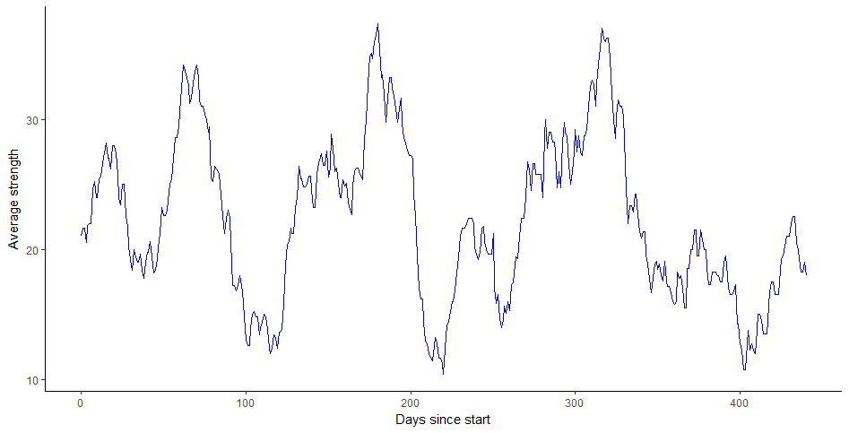

## **netTS**
An r package for extracting network measures as time series.

This package takes association data with time stamps and creates a time series of networks. This time series of networks can then be used to extract network measures at various levels: global network, local network, and dyadic.

 <br><br>

**Example: primate grooming associations**
Given a data frame with grooming associations and a time stamp (e.g., column names: to, from, time) we: 1) use graphTS to extract mean grooming strength in the network, 2) extract individual grooming strength, and 3) dyadic grooming strength.

 <br><br>

**1. Global measure of grooming associations: average network strength**
 
``` r
#extract network measure over time
ts.graph<-graphTS(event.data=groomEvents, windowSize=30, windowShift= 1, type="strength", directedNet=T)

#plot the measure
fig.graph.strength <- ggplot(data=ts.graph, aes(x = windowStart, y = strength)) + geom_path(color = "blue") + 
  labs(x = "Days since start", y="Average strength") + theme(legend.position="none") + theme_classic()
fig.graph.strength
```

 
 <br><br>
  
**2. Local measure of grooming associations: individual strength**
 
``` r
#extract network measure over time
ts.node<-nodeTS(event.data=groomEvents, windowSize=30, windowShift= 1, type="strength", directedNet=T)

#plot the measure
ts.node.melt<-melt(ts.node, id.vars = c("windowStart","windowEnd","windowStartDate","windowEndDate","nEvents"))
fig.node.strength <- ggplot(data=ts.node.melt, aes(x = windowStart, y = value, color=variable)) + geom_path() + 
  labs(x = "Days since start", y="Individual strength") + theme_classic()
fig.node.strength
```

Each line in this figure represents the network strength for each individual, i.e., the sum of all edge weights connected to this individual.

  <br><br>
 
**3. Dyadic measure of grooming associations: dyad strength**
 
``` r
#extract network measure over time
ts.dyad<-dyadTS(event.data=groomEvents, windowSize=30, windowShift= 1, type="strength", directedNet=T)

#plot the measure
ts.dyad.melt<-melt(ts.dyad, id.vars = c("windowStart","windowEnd","windowStartDate","windowEndDate","nEvents"))
fig.dyad.strength <- ggplot(data=ts.dyad.melt, aes(x = windowStart, y = value, color=variable)) + geom_path() + 
  labs(x = "Days since start", y="Dyad strength") + theme_classic()
fig.dyad.strength
```

Each line in this figure represents the network strength for each dyad, i.e., the edge weight between two individuals.

