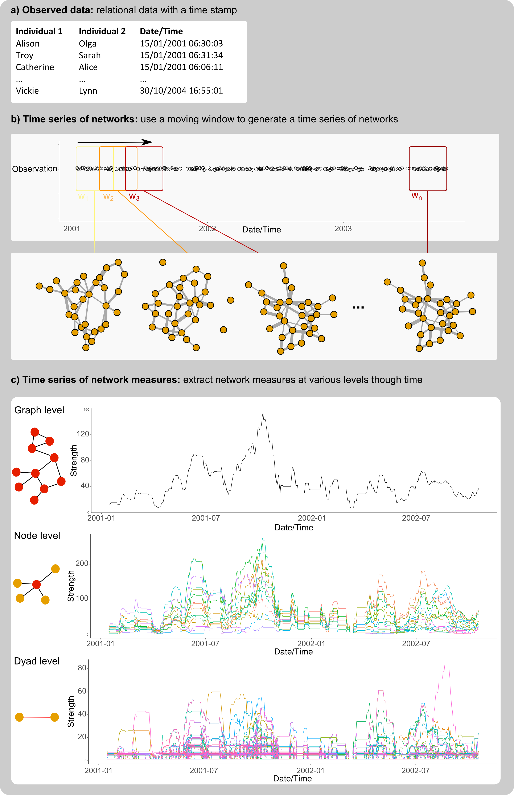

netTS: Introduction
------------

The netTS package is meant for relational data that takes place through time. Generally, when constructing social networks to interogate relational data, some amount of aggregation is required. E.g. group all data into years to create yearly networks. The point of this package is to facilitate this process of aggregation, using a moving window approach.

The moving window approach allows a user to define the size of a time window (e.g., windowsize = 1 month) and the amount to move the window (e.g., windowshift = 1 day). This moving window then subsets the relational data within a window, creates a network, and extracts a network measure. It then shifts over in time and repeats the process. By altering the size and shift of this moving window it is then possible to measure how networks change in time.

  

  

Install netTS, load some libraries
----------------------------------

``` r
devtools::install_github("tbonne/netTS")
library(netTS)
library(lubridate)
library(ggplot2)
library(igraph)
library(reshape2)
```


Look at some example data
-------------------------

This data is the rquired format for working with netTS. The first two coloumns should have information about what two entities are interacting. The third column should be the weight of those interactions. Finally, the fourth column should contain dates/times. This last column should be in date format (e.g., ymd, or ymd\_hms). The lubridate package can be helpful for setting this up.

``` r
head(groomEvents)
#>     from   to weight       date
#> 401 lisa tyva      1 2014-10-29
#> 402 brie tyva      1 2014-11-03
#> 403 brie tyva      1 2014-11-03
#> 404 puzz lisa      1 2014-11-03
#> 405 puzz lisa      1 2014-11-03
#> 406 daff puzz      1 2014-11-04
```

Extract graph level measures through time
------------------------------------------

The graphTS function requires windowsize and windowshift inputs to be in units of time. Again lubridate can be very useful here, as you can specify many kinds of times: e.g., years(10), months(10), hours(10), minutes(10), seconds(10). The measureFun input should be a function that takes as input an igraph network and returns one value. Here custom functions can be used. There are also some functions already in netTS that might be useful.

The idea of using functions here is to provide flexibility to users, and allow a wide range of network measures to be used. An example is provided below where: 1) a function is created, and 2) it is used to extract values from the data through time.

``` r

#1. create a small function
my.function <- function(graph){
  
  #calculate some measure from the graph
  my.value <- degree(graph, mode="all")
  
  #return the value 
  return(my.value)
  
}

#2. extract values through time
graph.values <- graphTS(groomEvents, windowsize = days(30), windowshift = days(10), measureFun = my.function, directed=TRUE)
#> [1] "45 networks extracted"
head(graph.values)
#>   measure nEvents windowstart  windowend
#> 2     6.0     102  2014-10-29 2014-11-28
#> 3     7.0     118  2014-11-08 2014-12-08
#> 4     8.0     144  2014-11-18 2014-12-18
#> 5     6.8      99  2014-11-28 2014-12-28
#> 6     6.4      95  2014-12-08 2015-01-07
#> 7     8.6     115  2014-12-18 2015-01-17
```

Plot the graph level measures through time

``` r
ggplot(graph.values, aes(x=windowstart, y=measure))+geom_point()+geom_line()+labs(y="Mean degree",x="Date")+theme_classic()
```


Compare observed measures to permutations
------------------------------------------

It is then possible to test whether these measures differ from random using permutations.

The perumation used here randomly swaps individuals in the events dataframe, so the number of edges remains the same but the IDs are randomly rearanged. The results here, from a subset of the data, suggest that the network shows lower mean degree than expected due to chance arrangement of events, i.e., individuals groom fewer partners than expected if grooming was random.

``` r
graph.values <- graphTS(groomEvents[1:200,], windowsize = days(30), windowshift = days(10), measureFun = degree_mean, directed=TRUE, nperm = 1000)
#> [1] "3 networks extracted"
#> 
  |                                                                       
  |===========================                                      |  42%
  |                                                                       
  |======================================================           |  83%
ggplot(graph.values, aes(x=windowstart, y=measure))+geom_point()+geom_line()+
  geom_ribbon(data=graph.values, aes(ymin=CI.low, ymax=CI.high), fill="red", alpha=0.2)+
  labs(y="Mean degree",x="Date")+theme_classic()
```


Measure network change
------------------------------------------

How quickly does the network change in time?

Here we show that it is possible to measure changes in the network. The measureFun in this case (when lagged == TRUE) should take two networks and return a single value. Here we use the cosine similarity measure, and use firstNet == TRUE, to compare the network over time to the first network observed. Similarly, we show the similar plot when comparing networks with a lag of 1 (i.e., 10 days apart due to windowshift of 10).

``` r
graph.change <- graphTS(groomEvents, windowsize = days(30), windowshift = days(10), measureFun = cosine_between_graphs, directed=TRUE, lagged = TRUE, firstNet = TRUE)
#> [1] "45 networks extracted"

graph.stability <- graphTS(groomEvents, windowsize = days(30), windowshift = days(10), measureFun = cosine_between_graphs, directed=TRUE, lagged = TRUE, lag = 1)
#> [1] "45 networks extracted"


ggplot(graph.change, aes(x=windowstart, y=measure))+geom_point()+geom_line()+labs(y="Network change from start (cosine)",x="Date")+theme_classic()
```


``` r
ggplot(graph.stability, aes(x=windowstart, y=measure))+geom_point()+geom_line()+labs(y="Network stability (cosine)",x="Date")+theme_classic()
```


Other levels of network change
------------------------------

It is also possible to ask how the network changes through time at the node level (i.e., the ego network) and the dyadic level (i.e., specific relationships).

For example, here we look at how node level changes in degree through time. Here the measureFun should be a function that takes one network and returns a value for each node.

``` r
node.values <- nodeTS(groomEvents, windowsize = days(30), windowshift = days(10), measureFun = degree, directed=TRUE)
#> [1] "45 networks extracted"
head(node.values)
#>   lisa brie puzz daff tyva herm naom need glad turt dott nEvents
#> 2    4   10   11    6    6    7    7    5    3   NA    1     102
#> 3    4    9   11   10    5    7    9    7    4    4   NA     118
#> 4    9    8   11    9    4    9   11    7    6    6   NA     144
#> 5    8    8    8    9    4    5    9    6    4    7   NA      99
#> 6    6    7    8    7    5    5   10    4    6    6   NA      95
#> 7    6   10   13    7    9    6   10    9    6   10   NA     115
#>   windowstart  windowend
#> 2  2014-10-29 2014-11-28
#> 3  2014-11-08 2014-12-08
#> 4  2014-11-18 2014-12-18
#> 5  2014-11-28 2014-12-28
#> 6  2014-12-08 2015-01-07
#> 7  2014-12-18 2015-01-17
```

Plot node level changes

``` r
df.node.values <- melt(node.values, id.vars = c("windowstart","windowend", "nEvents" ))
names(df.node.values)[names(df.node.values)=="variable"] <- "node"
names(df.node.values)[names(df.node.values)=="value"] <- "measure"
ggplot(df.node.values, aes(x=windowstart, y=measure, col=node))+geom_point()+geom_line() + theme_classic() + labs(y="Mean degree",x="Date")
```


For example, here we look at how dyad level changes in weight through time. Here the measureFun should be a function that takes one network and returns a value for each dyad.

``` r
dyad.values <- dyadTS(groomEvents, windowsize = days(30), windowshift = days(10), measureFun = dyad_weight, directed=TRUE)
#> [1] "45 networks extracted"
dyad.values[1:10,1:5]
#>    lisa_tyva brie_tyva puzz_lisa daff_puzz brie_puzz
#> 2          1         4         4         2         1
#> 3         NA        NA         2         2        NA
#> 4         NA        NA         2         2        NA
#> 5         NA        NA        NA         2        NA
#> 6         NA        NA        NA         1        NA
#> 7         NA        NA         2         1        NA
#> 8         NA        NA         2         3        NA
#> 9         NA         2         4         3        NA
#> 10         2         2         4         3        NA
#> 11         4         2         4         1        NA
```

Plot dyad level changes

``` r
df.dyad.values <- melt(dyad.values, id.vars = c("windowstart","windowend", "nEvents" ))
names(df.dyad.values)[names(df.dyad.values)=="variable"] <- "dyad"
names(df.dyad.values)[names(df.dyad.values)=="value"] <- "measure"
ggplot(df.dyad.values, aes(x=windowstart, y=measure, col=dyad))+geom_point()+geom_line() + theme_classic() + labs(y="Weight",x="Date") + theme(legend.position="right",legend.text = element_text(size=6))
```


Tutorials
------------------------------------------

1. [Introduction](inst/Tutorials/Intro_to_netTS.nb.html)
2. [Controling for sampling effort](inst/Tutorials/Control_for_sampling_effort.html)
3. [Controling for nodes entering and leaving the network.](inst/Tutorials/Control_for_entering_and_leaving.Rmd.nb.html)
4. [Network similarity](inst/Tutorials/Network_Similarity.html)
5. [Using network permutations](inst/Tutorials/Using_permutations.html)
5. [Using network simulations](inst/Tutorials/Using_simulated_event_data.html)
